# Fashion Stock Picker
 
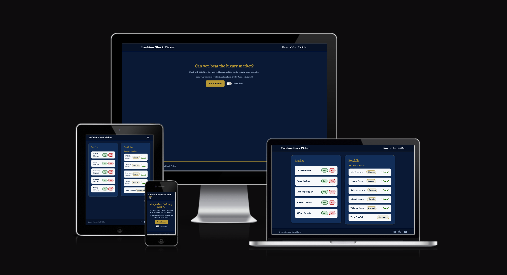
 
A web-based stock trading simulation game where players invest in luxury fashion brands. Start with €10,000, buy and sell stocks as the market fluctuates, and try to grow your portfolio. Reach +6% growth to unlock **Level 2** with €20,000 to invest and new luxury brands.
 
**Live Site:** https://sineadezita.github.io/milestone-project-2/
 
**Repository:** https://github.com/sineadezita/milestone-project-2
 
---
 
## Table of Contents
 
- [UX](#ux)
- [Wireframes](#wireframes)
- [Features](#features)
- [Security Features](#security-features)
- [Technologies Used](#technologies-used)
- [Testing](#testing)
- [Bugs Found and Fixed](#bugs-found-and-fixed)
- [Unfixed Bugs](#unfixed-bugs)
- [Deployment](#deployment)
- [Future Features](#future-features)
- [Credits](#credits)
---
 
## UX
 
### Project Goals
- Allow players to practice investing without risking real money
- Make stock trading fun and educational using luxury fashion brands
- Provide a responsive, intuitive experience on mobile and desktop

### Player Goals
- Learn the basics of stock trading in a simple, gamified environment
- Experience profit/loss tracking in real time
- Unlock new levels and brands as a reward for portfolio growth

### Developer/Business Goals
- Build a scaleable MVP that works fully in the browser
- Later expand with real stock market data via API integration
- Potential future monetisation through premium levels and brand partnerships

### User Stories
 
- As a **new player**, I want clear instructions so I can understand how to play immediately.
- As a **casual player**, I want a one-click Buy/Sell interface so trading is quick and easy.
- As a **competitive player**, I want to see my profits and losses so I can measure my success.
- As a **player**, I want to be able to reset the game and start again from the landing page.
- As a **player**, I want visual feedback when I make a trade so I know my action was registered.
- As a **player on mobile**, I want the game to work on my phone without any layout issues.

### Design Choices
 
- **Colour Palette**: Prussian blue and gold tones inspired by premium financial dashboards and luxury fashion branding, creating a professional aesthetic that reflects the high-end nature of the brands featured.
- **Typography**: Georgia serif font for an elegant, editorial feel consistent with luxury brand aesthetics.
- **Layout**: Card-based sections (Market and Portfolio) for familiarity with financial dashboards.
- **Responsiveness**: Mobile-first approach with media queries for all screen sizes.
---
 
## Wireframes
 
Wireframes were created during the planning stage of the project. The final design evolved from these initial concepts.
 
### Landing Page
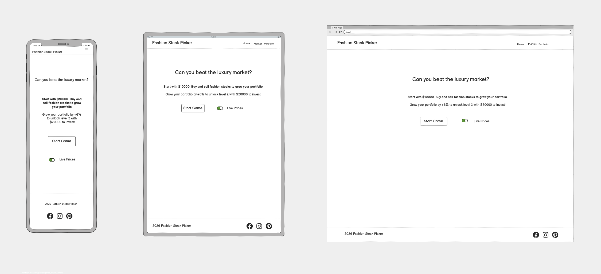
 
### Game View
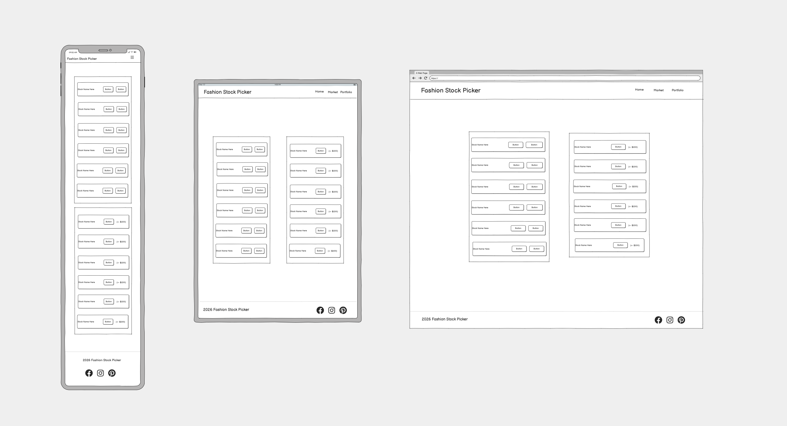
 
---
 
## Features
 
### Landing Page
The landing page presents the game title, instructions, a Start Game button and a Live Prices toggle. Players can enable live price fluctuations before starting the game.
 
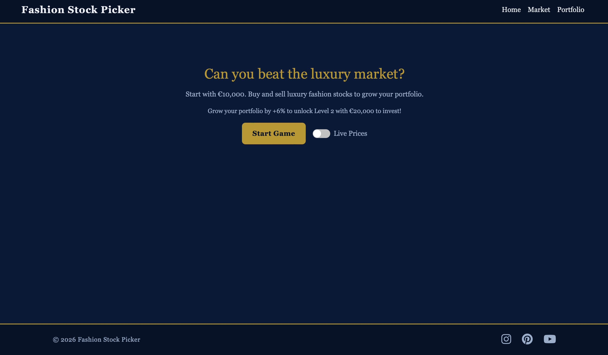
 
### Market Section
Displays all available stocks with their current prices and Buy/Sell buttons. Prices update every 5 seconds when Live Prices is enabled. A rate limiting system prevents rapid repeated trades.
 
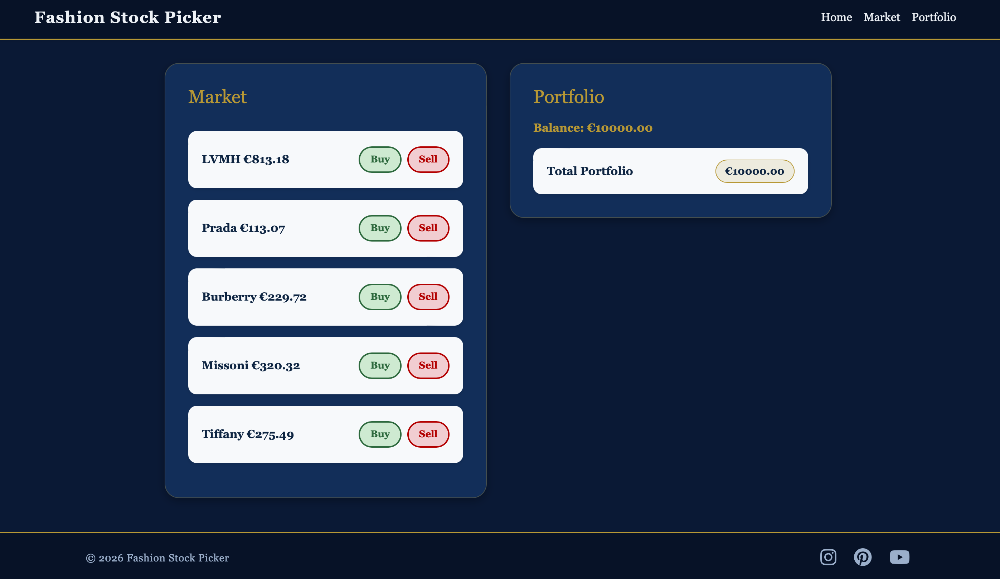
 
### Portfolio Section
Shows the player's current cash balance, all holdings with current value, profit/loss per stock colour coded in green (profit) or red (loss), and total portfolio value.
 
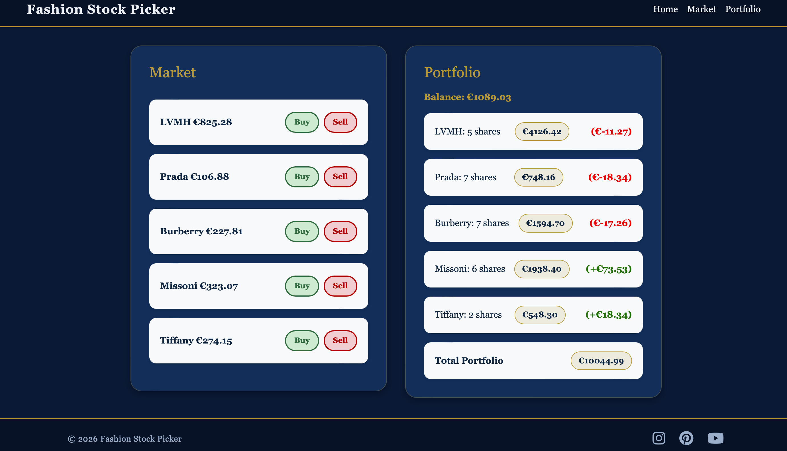
 
### Level Up System
When the player grows their portfolio by +6%, an inline notification congratulates them and Level 2 unlocks with €20,000 and new luxury brand stocks (Gucci, Chanel, Hermès, Moncler, Cartier).
 
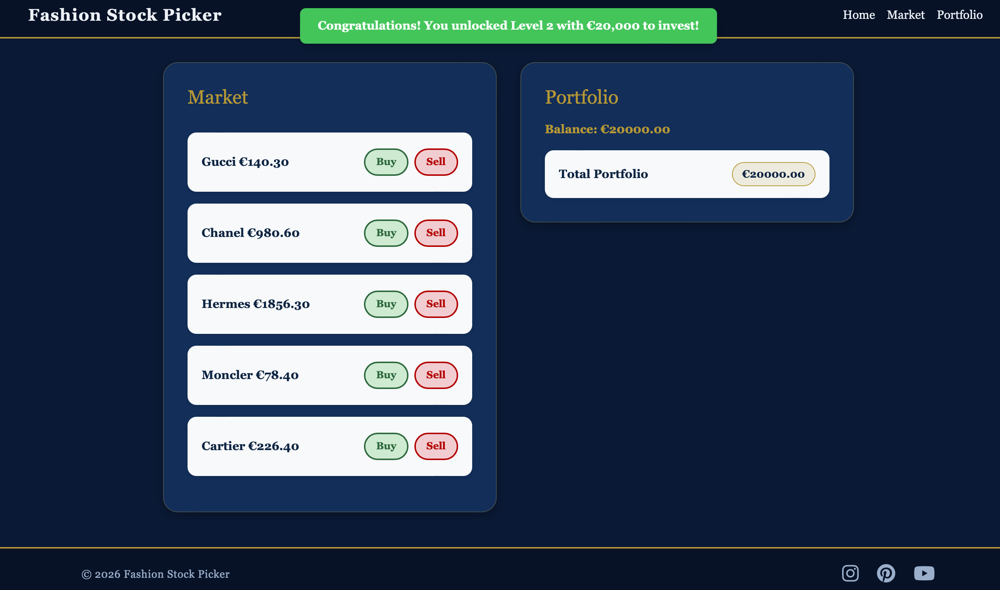
 
### Inline Notifications
User feedback is provided via styled inline notifications rather than browser alerts. Red notifications appear for errors (insufficient balance, no shares to sell) and green for success (level up).
 
### Home Navigation Reset
Clicking the Home nav link during a game resets the game fully and returns the player to the landing page, clearing all portfolio data and stopping live price updates.
 
### Responsive Design
The site is fully responsive. On mobile, stock rows stack with Buy/Sell buttons displayed side by side for easy tapping. Cards display full width on small screens.
 
### Footer
Includes copyright information and social media links (Instagram, Pinterest, YouTube) that open in new tabs with `rel="noopener noreferrer"` for security.
 
---
 
## Security Features
 
The following security features were implemented during development:
 
- **Content Security Policy (CSP)** — A CSP meta tag was added to `index.html` to protect against XSS and code injection attacks. The policy restricts scripts, styles and fonts to trusted sources only (self, Bootstrap CDN, Font Awesome CDN).
- **Rate Limiting** — A 1 second cooldown between buy/sell actions prevents rapid repeated trading and demonstrates the same logic used in web application security to prevent brute force actions.
- **`rel="noopener noreferrer"`** — All external links in the footer include this attribute to protect against tab-napping attacks where a malicious page could access the opener window.
---
 
## Technologies Used
 
### Languages
- **HTML5** — Structure and content
- **CSS3** — Styling, layout and responsive design
- **JavaScript** — Game logic, interactivity and DOM manipulation
### Frameworks and Libraries
- **Bootstrap 5** — Responsive navigation and grid layout
- **Font Awesome** — Icons throughout the site
- **Google Fonts** — Typography
### Tools
- **Git** — Version control
- **GitHub** — Repository hosting
- **GitHub Pages** — Live deployment
- **Balsamiq** — Wireframe creation
- **JSHint** — JavaScript validation
- **W3C Validator** — HTML validation
- **Jigsaw** — CSS validation
---
 
## Testing
 
### Manual Testing
 
All features were manually tested to ensure they function as expected across devices and browsers.
 
| **Feature** | **Action** | **Expected Result** | **Result** | **Pass/Fail** |
|-------------|------------|---------------------|------------|---------------|
| Start Game button | Click Start Game | Landing page hides, game section appears | Game section displays correctly | Pass |
| Live Prices toggle | Toggle on | Stock prices update every 5 seconds | Prices fluctuate every 5 seconds | Pass |
| Live Prices toggle | Toggle off | Price updates stop | Prices freeze immediately | Pass |
| Buy button | Click Buy on a stock | Balance decreases, share added to portfolio | Balance and holdings update correctly |Pass |
| Buy button — insufficient funds | Click Buy with insufficient balance | Error notification appears | "Not enough balance" notification shown | Pass |
| Sell button | Click Sell on owned stock | Balance increases, share removed from portfolio | Balance and holdings update correctly | Pass |
| Sell button — no shares | Click Sell with no shares owned | Error notification appears | "No shares to sell" notification shown | Pass |
| Rate limiting | Click Buy rapidly | Second click blocked for 1 second | "Please wait" notification shown | Pass |
| Profit/Loss display | Buy shares, price changes | Profit shown in green, loss in red | Colours display correctly | Pass |
| Total Portfolio value | Buy/Sell shares | Total updates to reflect cash + holdings | Total calculates correctly | Pass |
| Level Up | Grow portfolio by +6% | Level 2 unlocks with new stocks | Level 2 triggered with congratulations notification | Pass |
| Home nav link | Click Home during game | Game resets, landing page shows | Game resets correctly | Pass |
| Market nav link | Click Market | Scrolls to market section | Scrolls correctly | Pass |
| Portfolio nav link | Click Portfolio | Scrolls to portfolio section | Scrolls correctly | Pass |
| Hamburger menu | Resize to mobile, click hamburger | Navigation menu opens and closes | Menu toggles correctly | Pass |
| Instagram link | Click Instagram icon | Opens Instagram in new tab | Opens correctly | Pass |
| Pinterest link | Click Pinterest icon | Opens Pinterest in new tab | Opens correctly | Pass |
| YouTube link | Click YouTube icon | Opens YouTube in new tab | Opens correctly | Pass |
| Keyboard navigation | Tab through all elements | All interactive elements reachable | All elements accessible via Tab | Pass |
 
### Browser Compatibility
 
| **Browser** | **Result** |
|-------------|------------|
| Google Chrome | No issues |
| Mozilla Firefox | No issues |
| Safari | No issues |
 
### Responsive Testing
 
The site was tested across multiple screen sizes using [Am I Responsive](https://ui.dev/amiresponsive).
 
| **Device** | **Screen Size** | **Result** |
|------------|-----------------|------------|
| Desktop | 1920 x 1080 | No issues |
| Laptop | 1366 x 768 | No issues |
| Tablet | 768 x 1024 | No issues |
| Mobile | 375 x 667 | No issues |
 
### Validator Testing
 
#### HTML
The HTML was validated using the [W3C HTML Validator](https://validator.w3.org/) via the live deployed URL. No errors or warnings were found.
 
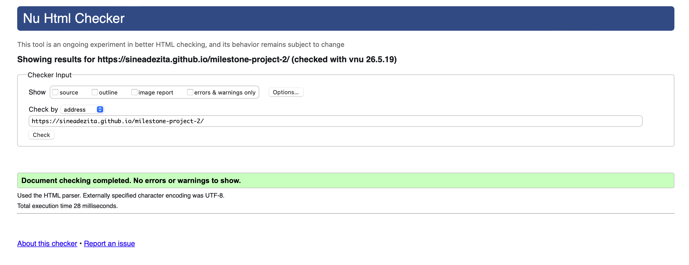
 
#### CSS
The CSS was validated using the [W3C CSS Validator (Jigsaw)](https://jigsaw.w3.org/css-validator/). No errors were found.
 
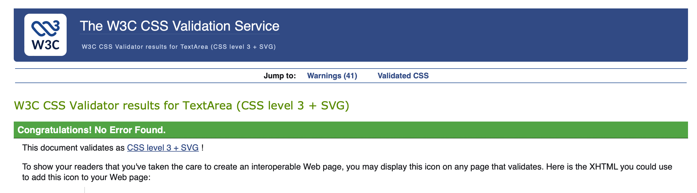
 
#### JavaScript
The JavaScript was validated using [JSHint](https://jshint.com/) with `/* jshint esversion: 6 */` to allow ES6 syntax. No errors or warnings were found in the final version.
 
**Before fixes:**
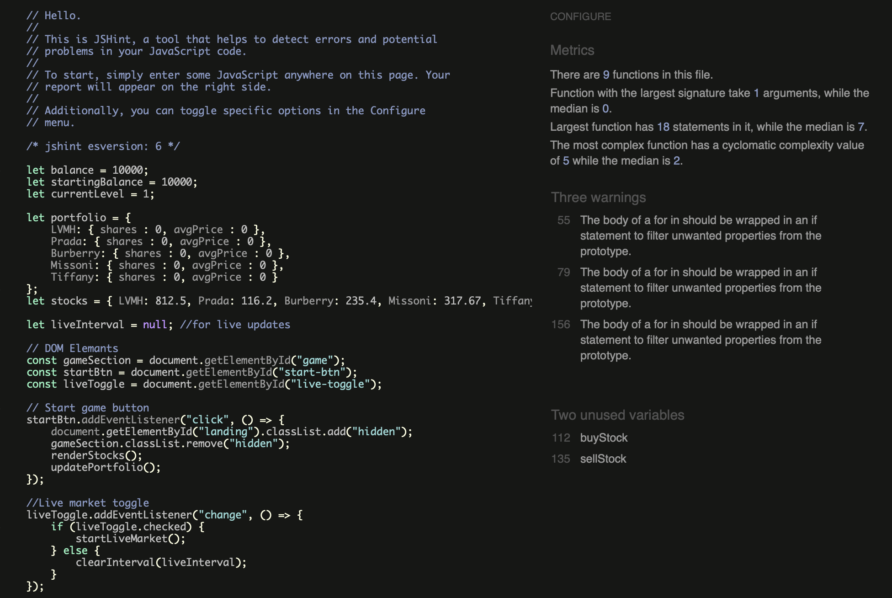
 
**After fixes:**
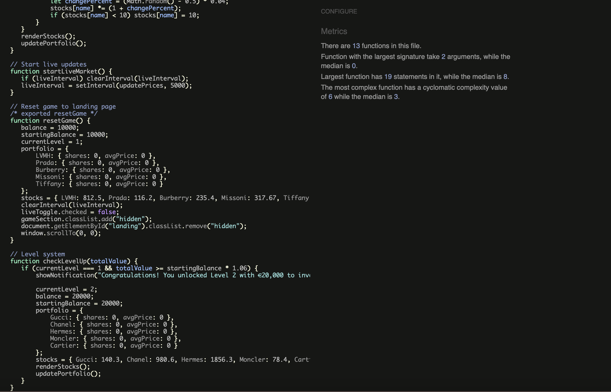
 
---
 
## Bugs Found and Fixed
 
| **Bug** | **Fix** |
|---------|---------|
| `for...in` loops flagged by JSHint | Wrapped loop bodies in `if (object.hasOwnProperty(key))` checks |
| `buyStock` and `sellStock` flagged as unused by JSHint | Added `/* exported buyStock */` and `/* exported sellStock */` comments as functions are called via inline onclick handlers |
| Live Prices toggle existed but did not function | Added `liveToggle.addEventListener("change")` to start/stop live market updates |
| Browser alert boxes interrupting game flow | Replaced all `alert()` calls with custom inline `showNotification()` function |
| Hamburger menu icon not visible on dark navbar | Bootstrap's default SVG toggler icon does not display on dark backgrounds. Replaced `` with a Font Awesome bars icon which displays correctly |
| Body background showing as green after Bootstrap load order change | Added `!important` to body background-color to override Bootstrap defaults |
| CSP meta tag blocking Font Awesome icons and inline onclick handlers | Updated CSP to include `'unsafe-inline'` for scripts and styles, and added Font Awesome CDN domains to allowed sources |
| CSS validator error — `var()` used with hex value | Replaced invalid `var(#F5F5F5)` with direct hex value `#F5F5F5` |
 
---
 
## Unfixed Bugs
 
There are no known unfixed bugs in the current version of the project.
 
---
 
## Deployment
 
### Live Site
The project is deployed on GitHub Pages: https://sineadezita.github.io/milestone-project-2/
 
### Deployment Steps
1. Navigate to the repository on GitHub
2. Go to the **Settings** tab
3. Scroll to the **Pages** section in the left sidebar
4. Under **Source**, select the `main` branch and `/root` folder
5. Click **Save**
6. GitHub Pages deploys automatically and provides a live URL
### Forking the Repository
1. Navigate to the repository on GitHub
2. Click the **Fork** button in the top right corner
3. A copy will be created in your own GitHub account
### Cloning the Repository
1. Navigate to the repository on GitHub
2. Click the **Code** button and copy the HTTPS URL
3. In your terminal run: `git clone https://github.com/sineadezita/milestone-project-2`
---
 
## Future Features
 
- **localStorage Game Persistence** — Save and resume game progress between sessions so players do not lose their portfolio when closing the browser
- **Level Progress Tracker** — Visual progress bar showing how close the player is to unlocking the next level (e.g. 4.2% of 6% target reached)
- **Level 3 — Real Stock Market API** — Integrate Finnhub or Alpha Vantage API to trade with real luxury brand stock prices (LVMH, Kering, Burberry) giving players exposure to actual market data
- **Transaction History / Audit Log** — Full record of all buy/sell actions with timestamps, prices and profit/loss per trade — mirroring the event logging used in SIEM security tools
- **Leaderboard** — Compare portfolio performance against other players
- **Scrollable Stock List** — Gold scrollbar on dark card to accommodate more stocks as levels expand
- **Mobile PWA** — Progressive Web App version installable on iOS and Android without an app store
- **Additional Security Features** — localStorage encryption, session timeout after inactivity, and full audit logging of all game actions
---
 
## Credits
 
### Content
- All written content created by the developer
- Game concept and logic developed by the developer
### Frameworks and Libraries
- [Bootstrap 5](https://getbootstrap.com/) — Navigation and responsive layout
- [Font Awesome](https://fontawesome.com/) — Icons throughout the site
- [MDN Web Docs](https://developer.mozilla.org/) — JavaScript reference
### Security References
- [OWASP Content Security Policy](https://owasp.org/www-community/controls/Content_Security_Policy) — CSP implementation guidance
- [Bootstrap Documentation](https://getbootstrap.com/docs/5.3/components/navbar/) — Navbar toggler icon SVG adapted for dark navbar backgrounds
### Tools
- [Balsamiq](https://balsamiq.com/) — Wireframe creation
- [Am I Responsive](https://ui.dev/amiresponsive) — Responsive mockup generation
- [W3C Validator](https://validator.w3.org/) — HTML validation
- [Jigsaw Validator](https://jigsaw.w3.org/css-validator/) — CSS validation
- [JSHint](https://jshint.com/) — JavaScript validation